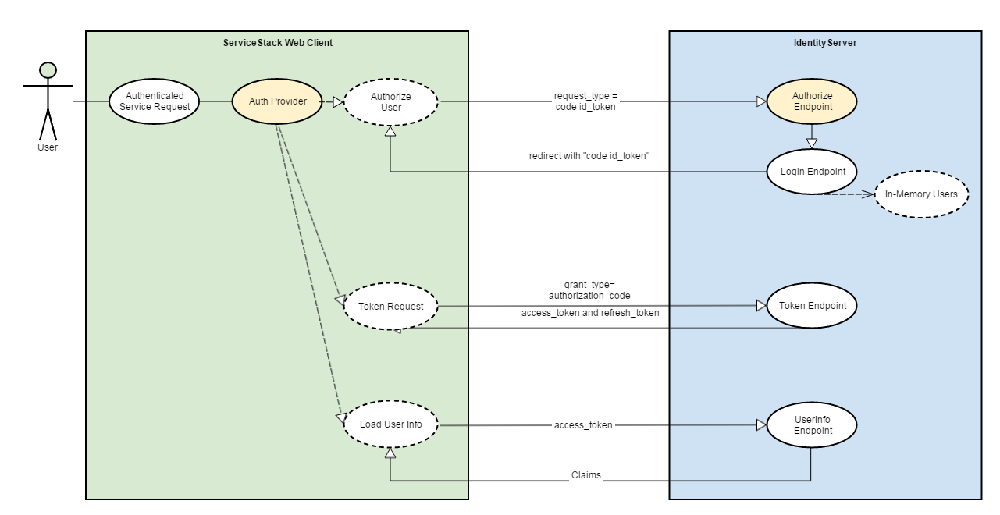

# ServiceStack.Authentication.IdentityServer

[](https://ci.appveyor.com/project/wwwlicious/servicestack-authentication-identityserver/branch/master)

ServiceStack.Authentication.IdentityServer : [](https://badge.fury.io/nu/ServiceStack.Authentication.IdentityServer)

IdentityServer3.Contrib.ServiceStack : [](https://badge.fury.io/nu/IdentityServer3.Contrib.ServiceStack)

A plugin for [ServiceStack](https://servicestack.net/) and [IdentityServer](https://identityserver.github.io/) that provides [OpenIDConnect](http://openid.net/connect/) / [OAuth 2.0](http://oauth.net/2/) Single Sign-On Authentication for a Client that consumes other services (e.g. in a microservices-based environment).

This enables a client servicestack instance to be redirected to an IdentityServer instance when they attempt to access a secure service without the necessary credentials.  The user is required to provide credentials to the IdentityServer instance such that on succesful authenticated, the user is redirected back to the servicestack instance which can authorize the user to access the secure service based on claims-based credentials provided by IdentityServer.

## Quick Start
Assuming that an existing ServiceStack Instance with a user front-end exists and an existing IdentityServer Instance exists. To create a vanilla IdentityServer instance please follow the steps [here](docs/newidentityserverinstance.md).

### ServiceStack Instance
Install the package to your Service Stack Instance:
```powershell
PM> Install-Package ServiceStack.Authentication.IdentityServer
```

Add the following to your AppHost Configure method
```csharp
public class AppHost : AppSelfHostBase
{
    private readonly string serviceUrl;
    public AppHost(string serviceUrl) : base("ServiceStack.SelfHost", typeof (MyServices).Assembly) { this.serviceUrl = serviceUrl; }

    public override void Configure(Container container)
    {
        SetConfig(new HostConfig
        {
            // the url:port that IdentityServer will know to redirect to upon succesful login
            WebHostUrl = serviceUrl
        });
                       
        this.Plugins.Add(new IdentityServerAuthFeature 
        {
            AuthProviderType = IdentityServerAuthProviderType.UserAuthProvider,
            AuthRealm = "http://identityserver:5000/",                          // The URL of the IdentityServer instance
            ClientId = "ServiceStack.SelfHost",                                 // The Client Identifier so that IdentityServer can identify the service
            ClientSecret = "F621F470-9731-4A25-80EF-67A6F7C5F4B8",              // The Client Secret so that IdentityServer can authorize the service
            Scopes = "openid ServiceStack.SelfHost offline_access"
        });
    }
}
```

Decorate a service with the following attribute
```csharp
public class SomeService : Service
{
    [Authenticate(IdentityServerAuthProvider.Name)]
    public object Any()
    {
        ...
    }    
}
```

### IdentityServer3 Instance

Add the following Client to the Identity Server Client data store (example below is assuming IdentityServer In-Memory Clients is being used).
```csharp
new Client
{
    ClientName = "ServiceStack.SelfHost",
    ClientId = "ServiceStack.SelfHost",                                 // The Client Identifier matching the IdentityServerAuthFeature.ClientId call
                                                                        // in the ServiceStack AppHost Configure() method above        
    Enabled = true,
        
    AccessTokenType = AccessTokenType.Jwt,                              // The AccessToken encryption type
        
    Flow = Flows.Hybrid,                                                // Uses the Hybrid flow

    ClientSecrets = new List<Secret>
    {
        new Secret("F621F470-9731-4A25-80EF-67A6F7C5F4B8".Sha256())     // The Client Secret matching IdentityServerAuthFeature.ClientSecret call
    },                                                                  // in the ServiceStack Setup

    AllowAccessToAllScopes = true,                                      
    
    RedirectUris = new List<string>
    {
        "http://localhost:5001/auth/IdentityServer"                     // The Address and Provider Uri of the ServiceStack Instance
    },

    RequireConsent = false                                              // Don't bother prompting for consent
}
```

Add the following Scope to the Identity Server Scope data store (example below is assuming IdentityServer In-Memory Scope is being used).

```csharp
new Scope
{
    Name = "ServiceStack.SelfHost",                                     // The Scope Identity matching the IdentityServerAuthFeature.ClientId call
                                                                        // in the ServiceStack AppHost Configure() method above       
    Enabled = true,
        
    Type = ScopeType.Identity,
    Claims = new List<ScopeClaim>
    {
        new ScopeClaim(Constants.ClaimTypes.Subject),
        new ScopeClaim(Constants.ClaimTypes.PreferredUserName)
    },
    ScopeSecrets = new List<Secret>
    {
        new Secret("F621F470-9731-4A25-80EF-67A6F7C5F4B8".Sha256())     // The Client Secret matching AppSettings.SetClientSecret() call
    }                                                                   // in the ServiceStack Setup
}
```

### IdentityServer4 Instance
IdentityServer4 is the dotnet core implementation of IdentityServer.  It differs from IdentityServer3 in that it no longer provides a UI.  For an example of a custom UI implementation of IdentityServer4 using asp.net core please refer to the [IdentityServer4.Quickstart.UI](https://github.com/IdentityServer/IdentityServer4.Quickstart.UI) project.

Add the following Client to the Identity Server Client data store (example below is assuming IdentityServer In-Memory Clients is being used).
```csharp
new Client
{
    ClientName = "ServiceStack.SelfHost",
    ClientId = "ServiceStack.SelfHost",                                 // The Client Identifier matching the IdentityServerAuthFeature.ClientId call
                                                                        // in the ServiceStack AppHost Configure() method above    

    Enabled = true,

    AccessTokenType = AccessTokenType.Jwt,                              // The AccessToken encryption type
                    
    AllowedGrantTypes = GrantTypes.Hybrid,                              // Uses the Hybrid flow

    ClientSecrets = new List<Secret>
    {
        new Secret("F621F470-9731-4A25-80EF-67A6F7C5F4B8".Sha256())     // The Client Secret matching IdentityServerAuthFeature.ClientSecret call
    },                                                                  // in the ServiceStack Setup

    RedirectUris = new List<string>
    {
        "http://localhost:5001/auth/IdentityServer"                     // The Address and Provider Uri of the ServiceStack Instance
    },

    AllowedScopes = new List<string>                                    // The requested scopes. Should match IdentityServerAuthFeature.Scopes
    {
        IdentityServerConstants.StandardScopes.OpenId,
        "ServiceStack.SelfHost"
    },

    AllowOfflineAccess = true,                                          // Set to true if requesting the offline_access scope

    RequireConsent = false                                              // Don't bother prompting for consent
}

Add the following Identity Resources (same as Identity Scopes) to the Identity Server IdentityResource data store (example below is assuming IdentityServer In-Memory IdentityResource is being used).
```csharp
new List<IdentityResource>
{
    new IdentityServer4.Models.IdentityResources.OpenId(),
    new IdentityResource
    {
        Name = "ServiceStack.SelfHost",
        Enabled = true,
        UserClaims = new List<string>
        {
            JwtClaimTypes.Subject,
            JwtClaimTypes.PreferredUserName
        }
    }
}
```


When you start up both the Identity Server Instance and the ServiceStack Instance, you should be redirected to the IdentityServer Instance when you try to access the service you secured with the Authenticate attribute.

## What just happened?
Assuming this worked first time for you then the following sequence of events should have occurred:



* Attempting to access a ServiceStack Service with the Authenticate attribute forces a redirect to the IdentityServer Auth Provider (added by the *IdentityServerAuthFeature()* plugin).
* The Auth Provider checks the current ServiceStack session for an *Access Token* issued by IdentityServer.
* Having yet to be issued with an Access Token, the Auth Provider redirects the request to IdentityServer [Authorization/Authentication Endpoint](https://identityserver.github.io/Documentation/docsv2/endpoints/authorization.html).

* *Authorization/Authentication Endpoint*
    * Checks the Service Stack Instance *Client Id* and *Client Secret* are valid.
    * Checks the redirect URL of the Service Stack Instance is valid (which must be the Service Stack Auth Provider Endpoint).
    * Checks the scopes requested are valid and the Client has permission.
    * Checks the request to find any existing credentials, as none are present it redirects to the IdentityServer login page.
    
* IdentityServer has local login configuration enabled so presents a username and password prompt.  
* IdentityServer checks the provided username and password using an implementation of the UserServiceBase class which accesses an underlying user data store.
* IdentityServer redirects to the ServiceStack Auth Provider and includes an *ID Token* and a *Code*

* The ServiceStack Auth Provider checks the *ID Token* is valid and has been signed by by the IdentityServer X509 Signing Certificate.
* The ServiceStack Auth Provider now uses the *Code* to request an *Access Token* from IdentityServer using the [Token](https://identityserver.github.io/Documentation/docsv2/endpoints/token.html) endpoint.

* *Token Endpoint*
   * Checks the Service Stack Instance *Client Id* and *Client Secret* are valid.
   * Checks the *Code* is valid.
   * The IdentityServer Instance issues the *Access Token*.
       * If a "refresh token" was also requested, IdentityServer checks that you have permission to use the Offline Access Scope.

* The ServiceStack Auth Provider now validates the "Access Token" with IdentityServer using the [Token Introspection](https://identityserver.github.io/Documentation/docsv2/endpoints/introspection.html) endpoint.

* *Introspection Endpoint*
    * Checks the Service Stack Instance *Client Id* and *Client Secret* are valid.
    * Checks the *Access Token* is valid.
    
* The ServiceStack Auth Provider now retrieves the Claims for the *Access Token* using the [User Info](https://identityserver.github.io/Documentation/docsv2/endpoints/userinfo.html) endpoint.

* *UserInfo Endpoint*
    * Checks the *Access Token* is valid.
    * Returns the Claims for the User that were part of the scopes that were requested when the initial Authorization took place.
    
* The ServiceStack Auth Provider populates the Service Stack Session with the Claims.

Read the sample Guide [here](docs/authenticate_user_sample.md) or view the code [here](samples/UserAuthProvider.ServiceStack.SelfHost)

## Accessing an external ServiceStack Instance

If we want to access another ServiceStack Instance and for that Instance to authenticate against IdentityServer, that second ServiceStack Instance is effectively a second client entity in terms of IdentityServer.
We have two options in how our second ServiceStack Instance can authenticate, depending on our use case:

##### Authenticate as a Service
The second ServiceStack Instance doesn't require any user credentials to perform it's function, it doesn't require any user permissions and is just carrying out a task that may be accessing underlying sensitive data.
In this case, the service just needs to Authenticate itself as a client of IdentityServer using a *Client ID* and *Client Secret*.

Read the Quick Start Guide for authentication as a service [here](docs/authenticate_service.md)
Read the sample Guide [here](docs/authenticate_service_sample.md) or view the code [here](samples/ServiceAuthProvider.ServiceStack.Api.SelfHost)

##### Authenticate as a Service on behalf of a User
The second ServiceStack Instance requires either user credentials to perform it's function or is locked down to only perform if a user has a certain role or permission.
In this case, the service first needs to Authenticate itself as a client of IdentityServer and then also Authenticate the user accessing the service so it can then determine if the user is authorized to access the service.
We don't however, want the user to have to login to IdentityServer again.

Read the Quick Start guide for authenticate as a service on behalf of a user [here](docs/authenticate_impersonate.md)

Read the sample guide [here](docs/authenticate_impersonate_sample.md) or view the code [here](samples/ImpersonateAuthProvider.ServiceStack.Api.SelfHost)
